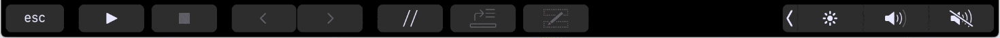

# karma-touchbar-reporter

A Karma plugin. Displays test results on the TouchBar.



## Installation

Make sure you're on _macOS 10.13_ and have _Xcode 9_ installed. `karma-touchbar-reporter` uses a helper program to interface with the TouchBar. To compile the helper simply `cd` into the directory and run `xcodebuild`.

```bash
cd karma-touchbar-reporter/helper
xcodebuild
```

## Options

The following options can be specified in your karma configuration under the key `"touchbarReporter"`. See `example/karma.conf.js` project for an example.

Option | Default                    | Effect
------ | -------------------------- | -------------------------------------------------
name   | `"name"` in `package.json` | Customize the name shown in the TouchBar popover.

## To Do List
 * Pass karma server url to helper
 * Visit url when _waiting for browser_-message is tapped
 * Show current state (running, failures, etc) in control strip
 * Build on installation (`node-gyp` or `post-install`-script)
 * Find proper icon for control strip item
 * Properly layout progress on larger test suites
 * Tap failed test to open failed expectation or reveal error message
